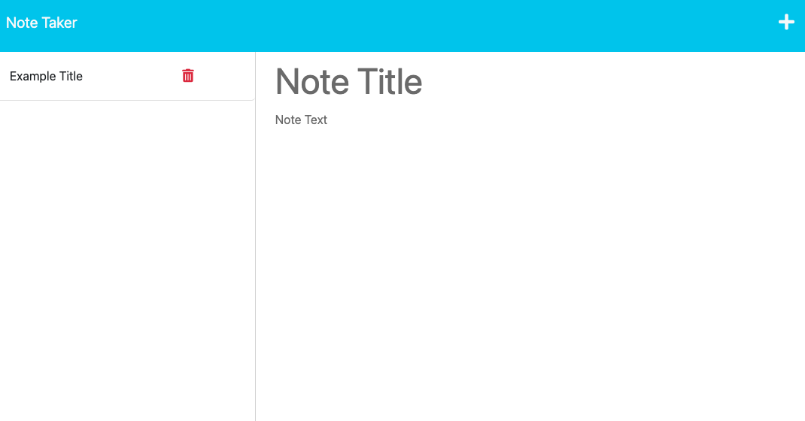

# Note-Taker

## Description

This note nater application allows the user to save notes in one conveinient place. By completing this app, I learned how to use express.js and how to deploy an application via heroku.

## Table of Contents (Optional)

- [Installation](#installation)
- [Usage](#usage)
- [Credits](#credits)
- [License](#license)

## Installation

To install this app, clone this repository to your local device, navigate to the "Develop" folder within the repository via command line, and enter "npm i" into the command line.

## Usage

To launch the app, type "server.js" into the command line after navigating to the "Develop" folder within the repository. Then, click "Get Started" which will lead you to the note taking page where you can type your notes.

## Credits

https://expressjs.com/en/guide/routing.html

https://developer.mozilla.org/en-US/docs/Learn/Server-side/Express_Nodejs/routes

https://www.youtube.com/watch?v=DQk3zJlY-eE&t=13s

## License

See LICENSE in root folder of this repostory.